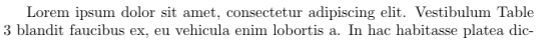
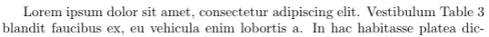

LaTeX is a high-quality typesetting system and the de facto standard for the publication of scientific documents. However, I never got a chance to learn how to use it formally. Most of my LaTeX knowledge comes from learning by doing. As I'm working on my Ph.D. thesis, I would like to share a few LaTeX tips that I wish I had known earlier. I got most of them from working with my advisors, internship hosts, and collaborators. There is still a lot for me to learn about LaTeX. Any comments and suggestions are welcome!

## 1. Non-breaking spaces

In digital typesetting, a non-breaking space is a space character that prevents an automatic line break at its position. It is like an invisible glue between two words. There are various situations where a non-breaking space is used. For example, if the phrase "100 km" does not fit at the end of a line, the word processor may insert a line break between "100" and "km", which is not desirable. 

LaTeX uses the `~` symbol as a non-breaking space. It is usually inserted before any numeric or alphabetic reference, for example, `Figure~\ref{fig:foo}` and `Section~\ref{sec:bar}`. Compare the following examples:

* Without a non-breaking space: `Table 3`

* With a non-breaking space: `Table~3` 

## 2. Citations using `\citet` and `\citep`

The `natbib` package is commonly used for handling references in LaTeX. It is included in the style files by default for many conferences including ICML, NIPS, ICLR, etc. See [here](https://gking.harvard.edu/files/natnotes2.pdf) for a reference sheet for `natbib`.

The two basic citation commands in `natbib` are

- `\citet` for **textual** citations,
- `\citep` for **parenthetical** citations.

The difference is that `\citet{jon90}` prints *Jones et al. (1990)*, while `\citep{jon90}` prints *(Jones et al., 1990)*. The choice depends on whether the authors are to be read as part of the sentence. According to the formatting instructions for ICLR 2019:

> When the authors or the publication are included in the sentence, the citation should not be in parenthesis (as in “See Hinton et al. (2006) for more information.”). Otherwise, the citation should be in parenthesis (as in “Deep learning shows promise to make progress towards AI (Bengio & LeCun, 2007).”).  

The command `\cite` should be avoided because its behavior depends on the citation format and might cause inconsistency. According to the `natbib` documentation:

> The standard LaTeX command `\cite` should be avoided, because it behaves like `\citet` for author-year citations, but like `\citep` for numerical ones.

## 3. Mathematical symbols

When writing mathematical formulas, people follow certain conventions of notations. In fact, there is an ISO standard [ISO 80000-2](https://people.engr.ncsu.edu/jwilson/files/mathsigns.pdf) that defines mathematical signs and symbols. I found an article titled [Typesetting mathematics for science and technology according to ISO 31/XI](https://tug.org/TUGboat/tb18-1/tb54becc.pdf) by Claudio Beccari. (ISO 31/XI is the precursor of ISO 80000-2.) The recommendations below are excerpts of the article. The "roman type" refers to upright letters and the "italic type" refers to sloping letters.

**a) Variables and functions are represented by one italic letter with modifiers such as subscripts, superscripts, primes, etc.**

| | LaTeX | Display |
|---|---|---|
| Correct | `L(x)` | \\(L(x)\\) |
| Correct | `L'(x)` | \\(L'(x)\\) |
| Correct | `L_{\mathrm{adversarial}}(x)` | \\(L_{\mathrm{adversarial}}(x)\\) |
| Incorrect | `LOSS(x)` | \\(LOSS(x)\\) |
| Incorrect | `Loss(x)` | \\(Loss(x)\\) |

**b) Mathematical operators indicated with letters must be set in roman type.**
This includes the predefined operators `\exp`, `\log`, `\sin`, `\tanh`, `\det`, `\min`, `\inf`, as well as user-defined operators.

| | LaTeX | Display |
|---|---|---|
| Correct | `\sin(2x) = 2 \sin(x) \cos(x)` | \\(\sin(2x) = 2 \sin(x) \cos(x)\\) |
| Incorrect | `sin(2x) = 2 sin(x) cos(x)` | \\(sin(2x) = 2 sin(x) cos(x)\\) |
| Correct | `\operatorname{softmax}(x)` | \\(\operatorname{softmax}(x)\\) |
| Incorrect | `softmax(x)` | \\(softmax(x)\\) |

**c) A particular operator, the operator of differentiation, should be set in roman type.** 
This one is somewhat controversial. In some fields, italic type seems more common. I personally prefer roman type.

| | LaTeX | Display |
|---|---|---|
| Correct | `\int x \mathrm{d} x` | \\(\int x \mathrm{d} x\\) |
| Incorrect | `\int x dx` | \\(\int x dx\\) |

**d) Sub and superscripts that do not represent mathematical variables should be set in roman type.**
The first row is correct because \\(n\\) represents a variable here.

| | LaTeX | Display |
|---|---|---|
| Correct | `S_n = \sum_{i=1}^n X_i` | \\( S\_n = \sum\_{i=1}^n X\_i \\) |
| Correct | `L_{\mathrm{adversarial}}(x)` | \\(L_{\mathrm{adversarial}}(x)\\) |
| Incorrect | `L_{adversarial}(x)` | \\(L_{adversarial}(x)\\) |

## 4. Avoid `\vspace`

Most conferences have strict page limits. More often than not, eight pages are not enough to adequately present a brilliant idea. If only Fermat got more space in the margin!

A common trick is to use `\vspace`. It can reduce the length of vertical space before or after a section, figure or table. However, this essentially alters the style template. Many formatting instructions explicitly forbid the use of `\vspace`. It might even result in the rejection of the paper. From the formatting instructions for AAAI 2019:

> if your paper is obviously &ldquo;squeezed&rdquo; it is not going to be accepted.

Reducing the vertical spaces also makes the paper less readable for the reviewers, so it is definitely not advisable.
Many conferences support the submission of supplementary material. If the paper is too long, consider reorganizing it and moving some sections to the supplementary material.
