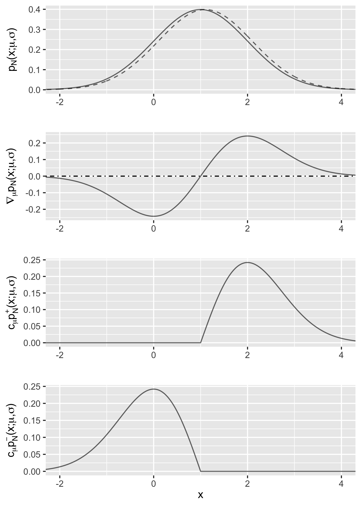
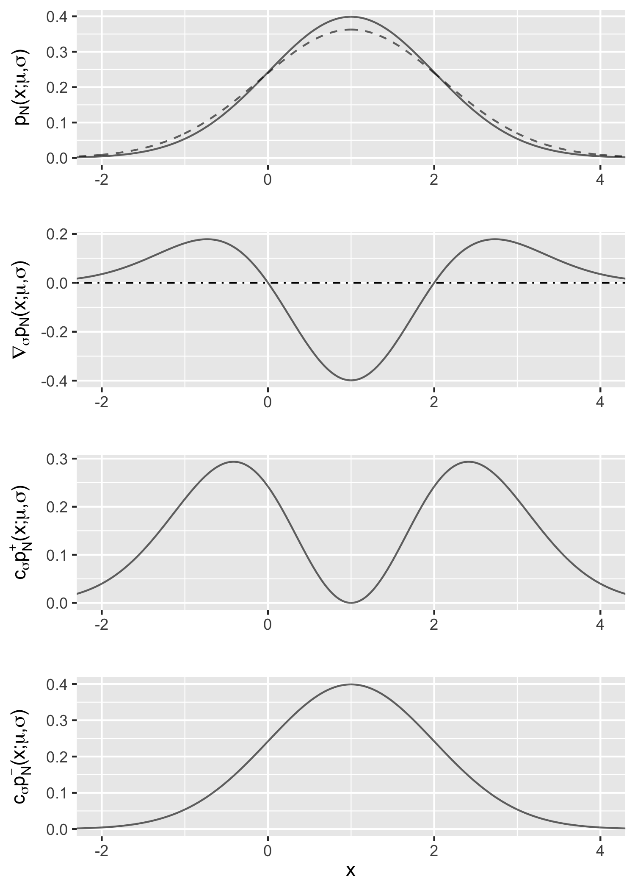
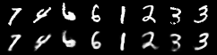
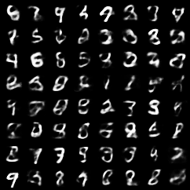

In machine learning, the gradient estimation problem lies at the core of various problems. 
Mohamed et al. (2019) give a comprehensive survey of this topic, from which I learned an intriguing approach called the _measure-valued gradient estimator_.
In this post, we give a brief review of the measure-valued gradient estimator and use it to train a variational autoencoder.

## 1. Monte Carlo gradient estimation

Given a random variable $\boldsymbol{x} \in \mathbb{R}^d$, its density function $p(\boldsymbol{x}; \boldsymbol\theta)$ parametrized by $\boldsymbol\theta \in \Theta \subset \mathbb{R}^m$, and a function $f: \mathbb{R}^d \to \mathbb{R}$, the problem of gradient esitmation pertains to the gradient of the expectation of $f(\boldsymbol{x})$ with respect to the parameters $\boldsymbol\theta$:
$$
\boldsymbol\eta := \nabla\_\boldsymbol\theta \mathbb{E}\_{\boldsymbol{x} \sim p(\boldsymbol{x}; \boldsymbol\theta)} f(\boldsymbol{x}).
$$
Estimating this quantity is crucial to the policy gradient methods in reinforcement learning, learning the approximate posterior distribution in variational inference, and sensitivity analysis in other fields.

Monte Carlo gradient estimation methods try to estimate $\boldsymbol\eta$ using Monte Carlo samples.
There are two well-known methods: the _score function estimator_ and the _pathwise estimator_.
The _score function estimator_ is also known as the _REINFORCE estimator_.
It rewrites $\boldsymbol\eta$ using the "log-derivative trick":
\begin{align}
\boldsymbol\eta &= 
\nabla\_\boldsymbol\theta \mathbb{E}\_{\boldsymbol{x} \sim p(\boldsymbol{x}; \boldsymbol\theta)} f(\boldsymbol{x})
\newline
&= \nabla\_\boldsymbol\theta \int f(\boldsymbol{x}) p(\boldsymbol{x}; \boldsymbol\theta) \mathrm{d} \boldsymbol{x}
\newline
&= \int f(\boldsymbol{x}) \nabla\_\theta p(\boldsymbol{x}; \boldsymbol\theta) \mathrm{d} \boldsymbol{x}
\newline
&= \int f(\boldsymbol{x}) p(\boldsymbol{x}; \boldsymbol\theta) \nabla\_\boldsymbol\theta \log p(\boldsymbol{x}; \boldsymbol\theta) \mathrm{d} \boldsymbol{x}
\newline
&= \mathbb{E}\_{\boldsymbol{x} \sim p(\boldsymbol{x}; \boldsymbol\theta)} [ f(\boldsymbol{x}) \nabla\_\boldsymbol\theta \log p(\boldsymbol{x}; \boldsymbol\theta)].
\end{align}
It is obvious that this expectation can be estimated by the sample mean:
$$
\widehat{\boldsymbol\eta} = \frac{1}{k} \sum\_{i=1}^k f(\widehat{\boldsymbol{x}}\_i) \nabla\_\boldsymbol\theta \log p(\widehat{\boldsymbol{x}}\_i; \boldsymbol\theta), 
\quad \widehat{\boldsymbol{x}}\_i \overset{\mathrm{iid}}{\sim} p(\boldsymbol{x}; \boldsymbol\theta).
$$
Another commonly used estimator is the _pathwise estimator_, also known as the _reparametrization trick_. The idea is to rewrite $\boldsymbol{x}$ as a function of another random variable following a base distribution.
Specifically, if $\boldsymbol{x} \overset{d}{=} g(\boldsymbol\epsilon; \boldsymbol\theta)$, where $\boldsymbol\epsilon \sim p(\boldsymbol\epsilon)$ that does not depend on $\boldsymbol\theta$, then
\begin{align}
\boldsymbol\eta &= 
\nabla\_\boldsymbol\theta \mathbb{E}\_{\boldsymbol{x} \sim p(\boldsymbol{x}; \boldsymbol\theta)} f(\boldsymbol{x})
\newline
&= \nabla\_\boldsymbol\theta \int p(\boldsymbol{x}; \boldsymbol\theta) f(\boldsymbol{x}) \mathrm{d} \boldsymbol{x}
\newline
&= \nabla\_\boldsymbol\theta \int p(\boldsymbol\epsilon) f(g(\boldsymbol\epsilon; \boldsymbol\theta)) \mathrm{d} \boldsymbol\epsilon
\newline
&= \int p(\boldsymbol\epsilon) \nabla\_\boldsymbol\theta f(g(\boldsymbol\epsilon; \boldsymbol\theta)) \mathrm{d} \boldsymbol\epsilon
\newline
&= \mathbb{E}\_{\boldsymbol\epsilon \sim p(\boldsymbol\epsilon)} [ \nabla\_\boldsymbol\theta f(g(\boldsymbol\epsilon; \boldsymbol\theta)) ].
\end{align}
Again, the above quantity can be estimated by Monte Carlo samples from the base distribution $p(\boldsymbol\epsilon)$:
$$
\widehat{\boldsymbol\eta} = \frac{1}{k} \sum_{i=1}^k \nabla\_\boldsymbol\theta f(g(\widehat{\boldsymbol\epsilon}\_i; \boldsymbol\theta)), 
\quad \widehat{\boldsymbol\epsilon}\_i \overset{\mathrm{iid}}{\sim} p(\boldsymbol\epsilon).
$$

We refer the interested readers to Mohamed et al. (2019) for a more detailed exposition of the two estimators.

## 2. Measure-valued gradient estimator

There exists another estimator that is less familiar to the machine learning community called the _measure-valued gradient estimator_.
We first define the estimator, then provide two simple examples. 
Finally, the pros and cons of it are briefly discussed.

### 2.1. Definition

We only consider a distribution with a scalar parameter $\theta \in \mathbb{R}$ for now.
It can be shown that the derivative of the density $\nabla\_\theta p(\boldsymbol{x}; \theta)$ can always be decomposed into the difference of two densities multiplied by a constant:
$$
\nabla\_\theta p(\boldsymbol{x}; \theta) = c\_\theta \left(p^+ (\boldsymbol{x}; \theta) - p^- (\boldsymbol{x}; \theta) \right),
$$
where $p^+$ and $p^-$ are probability densities, referred to as the positive and negative components, respectively, and $c\_\theta \in \mathbb{R}$ is a constant.
The triplet $(c\_\theta, p^+, p^-)$ is called the _weak derivative_ of $p(\boldsymbol{x}; \theta)$.
This decomposition applies to discrete distributions as well.

Using the weak derivative, the gradient $\eta$ can be rewritten as follows:
\begin{align}
\eta
&= \nabla\_{\theta} \mathbb{E}\_{\boldsymbol{x} \sim p(\boldsymbol{x}; \theta)} f(\boldsymbol{x})
\newline
&= \nabla\_\theta \int f(\boldsymbol{x}) p(\boldsymbol{x}; \theta) \mathrm{d} \boldsymbol{x}
\newline
&= \int f(\boldsymbol{x}) \nabla\_\theta p(\boldsymbol{x}; \theta) \mathrm{d} \boldsymbol{x}
\newline
&= c\_\theta \left( \int f(\boldsymbol{x}) p^+ (\boldsymbol{x}; \theta) \mathrm{d} \boldsymbol{x} - \int f(\boldsymbol{x}) p^- (\boldsymbol{x}; \theta) \mathrm{d} \boldsymbol{x} \right)
\newline
&= c\_\theta \left( \mathbb{E}\_{\boldsymbol{x}^+ \sim p^+(\boldsymbol{x}; \theta)} f(\boldsymbol{x}^+) - \mathbb{E}\_{\boldsymbol{x}^- \sim p^-(\boldsymbol{x}; \theta)} f(\boldsymbol{x}^-)  \right).
\end{align}

The corresponding estimator is
$$
\widehat{\eta} = \frac{c\_\theta}{k} \sum_{i=1}^k \left[ f(\widehat{\boldsymbol{x}}\_i^+) - f(\widehat{\boldsymbol{x}}\_i^-) \right], 
\quad \widehat{\boldsymbol{x}}\_i^+ \overset{\mathrm{iid}}{\sim} p^+(\boldsymbol{x}; \theta) \mbox{ and } \widehat{\boldsymbol{x}}\_i^- \overset{\mathrm{iid}}{\sim} p^-(\boldsymbol{x}; \theta).
$$

Note that $\boldsymbol{x}\_i^+$ and $\boldsymbol{x}\_i^-$ do not need to be independent. In fact, it is a common trick to make $f(\boldsymbol{x}\_i^+)$ and $f(\boldsymbol{x}\_i^-)$ positively correlated in order to reduce the variance of the estimator; this is known as _coupling_. 

### 2.2. Two examples 

Before introducing the examples, we first review a few relevant distribution families and their density functions.

- [Normal distribution](https://en.wikipedia.org/wiki/Normal_distribution) $\mathcal{N}(\mu, \sigma^2)$:
$$
p\_{\mathcal{N}}(x; \mu, \sigma) = \frac{1}{\sigma \sqrt{2\pi}} \exp\left(- \frac{(x - \mu)^2}{2\sigma^2}\right).
$$

- [Weibull distribution](https://en.wikipedia.org/wiki/Weibull_distribution) $\mathcal{W}(\lambda, k)$:
$$
p\_{\mathcal{W}}(x; \lambda, k)
= \frac{k}{\lambda} \left( \frac{x}{\lambda} \right)^{k-1} \exp \left( -\left( \frac{x}{\lambda} \right)^k \right) \mathbb{I}\_{x \geq 0}.
$$

- Double-sided [Maxwell distribution](https://en.wikipedia.org/wiki/Maxwell%E2%80%93Boltzmann_distribution) $\mathcal{M}(\mu, \sigma^2)$:
$$
p\_{\mathcal{M}}(x; \mu, \sigma) =
\frac{(x-\mu)^2}{\sigma^3\sqrt{2 \pi}} \exp\left( -\frac{(x-\mu)^2}{2 \sigma^2} \right).
$$

__Example 1__ (Normal distribution with respect to the location parameter).
Consider the derivative of the density function of $\mathcal{N}(\mu, \sigma^2)$ with respect to $\mu$.
We would like to show that
\begin{equation}
\nabla\_\mu p\_{\mathcal{N}}(x; \mu, \sigma) = c\_\mu \left(p^+ (x; \mu, \sigma) - p^- (x; \mu, \sigma) \right),
\label{eq:gaussian-mean}
\tag{1}
\end{equation}
where
- $c\_\mu = (\sigma \sqrt{2\pi})^{-1} $;
- $p^+$ is the density function of $\mu + \sigma \mathcal{W}(\lambda=\sqrt{2}, k=2)$;
- $p^-$ is the density function of $\mu - \sigma \mathcal{W}(\lambda=\sqrt{2}, k=2)$.

The notation $\mu \pm \sigma \mathcal{W}(\lambda=\sqrt{2}, k=2)$ represents a random variable $\mu \pm \sigma Y$, where $Y \sim \mathcal{W}(\lambda=\sqrt{2}, k=2)$, the Weibull distribution.

__Proof.__ For the left-hand side of Equation&nbsp;\ref{eq:gaussian-mean}, basic calculus shows that
$$
\nabla\_{\mu}
p\_{\mathcal{N}}(x; \mu, \sigma) = \frac{x-\mu}{\sigma^3 \sqrt{2\pi}} \exp\left(- \frac{(x - \mu)^2}{2\sigma^2}\right).
$$

Recall that the density function of a Weibull random variable $\mathcal{W}(\lambda=\sqrt{2}, k=2)$ is
$$
p\_\mathcal{W}(x; \lambda=\sqrt{2}, k=2) = x \exp\left( -\frac{x^2}{2} \right) \mathbb{I}\_{x \geq 0}.
$$
Using the [change of variables formula](https://en.wikipedia.org/wiki/Probability_density_function#Function_of_random_variables_and_change_of_variables_in_the_probability_density_function), we have
$$
p^+(x; \mu, \sigma) = \frac{x-\mu}{\sigma^2} \exp\left( -\frac{(x-\mu)^2}{2\sigma^2} \right) \mathbb{I}\_{x \geq \mu}
$$
and
$$
p^-(x; \mu, \sigma) = -\frac{x-\mu}{\sigma^2} \exp\left( -\frac{(x-\mu)^2}{2\sigma^2} \right) \mathbb{I}\_{x \leq \mu}.
$$
Therefore, the right-hand side of Equation&nbsp;\ref{eq:gaussian-mean} is

$$
c\_\mu \left(p^+ (x; \mu, \sigma) - p^- (x; \mu, \sigma) \right)=
\frac{x-\mu}{\sigma^3 \sqrt{2\pi}} \exp\left(- \frac{(x - \mu)^2}{2\sigma^2}\right),
$$
which equals the left-hand side.

Figure 1 gives an illustration of this example with $\mu=\sigma=1$. 
The first row shows the density function $p\_{\mathcal{N}}(x; \mu, \sigma)$ (the solid line) and how it changes when $\mu$ increases by 0.1 (the dashed line); the difference (divided by 0.1) is approximately the gradient of interest.
The second row is the gradient $\nabla\_{\mu} p\_{\mathcal{N}}(x; \mu, \sigma)$.
The last two rows are the positive and negative components multiplied by the constant $c\_\mu$, respectively; it indicates that the difference between them matches the curve in the second row.

<figure>
    
    <figcaption>Figure 1: Derivative of a normal density with respect to the location parameter.</figcaption>
</figure>

__Example 2__ (Normal distribution with respect to the scale parameter).
Consider the derivative of the density function of $\mathcal{N}(\mu, \sigma^2)$ with respect to $\sigma$.
We would like to show that
\begin{equation}
\nabla\_\sigma p\_{\mathcal{N}}(x; \mu, \sigma) = c\_\sigma \left(p^+ (x; \mu, \sigma) - p^- (x; \mu, \sigma) \right),
\label{eq:gaussian-std}
\tag{2}
\end{equation}
where
- $c\_\sigma = \sigma^{-1}$;
- $p^+ = p\_\mathcal{M}(x; \mu, \sigma)$;
- $p^-= p\_\mathcal{N}(x; \mu, \sigma)$.

__Proof.__ The proof is similar to that of Example 1 using basic calculus:
\begin{align}
&\quad \nabla\_{\sigma}
p\_{\mathcal{N}}(x; \mu, \sigma) 
\newline
& = \frac{1}{\sigma} \left[ \frac{(x-\mu)^2}{\sigma^3 \sqrt{2\pi}} \exp\left(- \frac{(x - \mu)^2}{2\sigma^2}\right) - \frac{1}{\sigma \sqrt{2\pi}} \exp\left(- \frac{(x - \mu)^2}{2\sigma^2}\right) \right]
\newline
& = \sigma^{-1} \left( p\_\mathcal{M}(x; \mu, \sigma) - p\_\mathcal{N}(x; \mu, \sigma) \right).
\end{align}

Figure 2 is the corresponding illustration.

<figure>
    
    <figcaption>Figure 2: Derivative of a normal density with respect to the scale parameter.</figcaption>
</figure>

### 2.3. Pros and cons

The advantage of the measure-valued gradient estimator is its flexibility. 
It is applicable to both continuous and discrete random variables.
Also, unlike the pathwise estimator, it does not assume the function $f$ to be differentiable.
Furthermore, there are distributions where the measure-valued gradient estimator is applicable, but the score function estimator is not, for example, the uniform distribution $\mathcal{U}(0, \theta)$.

One major disadvantage is its computational cost.
The estimator only applies to a single parameter. 
For distributions with many parameters, it requires two forward passes of the function $f$ for each parameter, which might be computationally prohibitive.

## 3. Application to variational autoencoder

As mentioned before, the pathwise estimator or reparametrization trick is commonly used in variation inference, in particular, the variational autoencoder (VAE).
The objective of VAE is to maximize the _evidence lower bound_ (ELBO), 
$$
\mathcal{L} = \mathbb{E}\_{\boldsymbol{z} \sim q\_{\boldsymbol\phi}(\boldsymbol{z} | \boldsymbol{x})}
\log ( p\_{\boldsymbol\theta}(\boldsymbol{x} | \boldsymbol{z})  ) - D\_{\mathrm{KL}} ( q\_{\boldsymbol\phi}(\boldsymbol{z} | \boldsymbol{x}) \parallel p(\boldsymbol{z}) ),
$$
where $D\_{\mathrm{KL}}$ denotes the [Kullback–Leibler divergence](https://en.wikipedia.org/wiki/Kullback%E2%80%93Leibler_divergence);
$\boldsymbol{x}$ and $\boldsymbol{z}$ are the observed and latent variables, respectively; 
$p(\boldsymbol{z})$ is the prior distribution of $\boldsymbol{z}$;
$p\_{\boldsymbol\theta}(\boldsymbol{x} | \boldsymbol{z})$ is the generative distribution and is implemented by a decoding network parametrized by $\boldsymbol\theta$;
$q\_{\boldsymbol\phi}(\boldsymbol{z} | \boldsymbol{x})$ is the variational distribution and is implemented by an encoding network parametrized by $\boldsymbol\phi$.

Given a sample $\boldsymbol{z} \sim q\_{\boldsymbol\phi}(\boldsymbol{z} | \boldsymbol{x})$, the gradient with respect to the decoder parameters $\nabla\_{\boldsymbol\theta} \mathcal{L}$ can be easily obtained by automatic differentiation.
Furthermore, if $p(\boldsymbol{z})$ and $q\_{\boldsymbol\phi}(\boldsymbol{z} | \boldsymbol{x})$ are both diagonal Gaussians, the KL divergence has a closed-form expression, and $\nabla\_{\boldsymbol\phi} D\_{\mathrm{KL}} ( q\_{\boldsymbol\phi}(\boldsymbol{z} | \boldsymbol{x}) \parallel p(\boldsymbol{z}) )$ can also be computed via automatic differentiation.
However, to estimate $\nabla\_{\boldsymbol\phi} \mathbb{E}\_{\boldsymbol{z} \sim q\_{\boldsymbol\phi}(\boldsymbol{z} | \boldsymbol{x})} \log ( p\_{\boldsymbol\theta}(\boldsymbol{x} | \boldsymbol{z})  )$, a Monte Carlo gradient estimator is necessary.
In this section, we demonstrate how to estimate it using the measure-valued gradient estimator.
The code is adapted from the [PyTorch VAE example](https://github.com/pytorch/examples/tree/master/vae).

We first define the `VAE` module. The encoder and decoder are both two-layer fully connected networks, with default arguments `args.hidden_dim = 400` and `args.z_dim = 20`.
The only difference from the original code is the line `z = z.detach()` in `reparameterize()`. This is to prevent the gradient $\nabla\_{\boldsymbol\phi} \mathbb{E}\_{\boldsymbol{z} \sim q\_{\boldsymbol\phi}(\boldsymbol{z} | \boldsymbol{x})} \log ( p\_{\boldsymbol\theta}(\boldsymbol{x} | \boldsymbol{z}) )$ from flowing into the encoder network.

Assuming $p\_{\boldsymbol\theta}(\boldsymbol{x} | \boldsymbol{z})$ is a Bernoulli distribution,  $\log p\_{\boldsymbol\theta}(\boldsymbol{x} | \boldsymbol{z})$ is the binary cross entropy function and it is the integrand.

Next, we need to be able to sample from the Weibull distribution and double-sided Maxwell distribution.
PyTorch has a built-in Weibull distribution class, and we can directly sample from an instance of that class.
For the double-sided Maxwell distribution, we can use the following property to sample from $\mathcal{M}(0, 1)$:

> If $X \sim \mathrm{Bernoulli}(1/2)$, $Y \sim \mathrm{Gamma}(3/2, 1/2)$, and $X$ and $Y$ are independent, then $(2X - 1) \sqrt{Y} \sim \mathcal{M}(0, 1)$.

Now we are ready to introduce the most crucial function `get_mu_std_grad()`. It returns the estimated gradient of $\mathbb{E}\_{\boldsymbol{z} \sim q\_{\boldsymbol\phi}(\boldsymbol{z} | \boldsymbol{x})} \log ( p\_{\boldsymbol\theta}(\boldsymbol{x} | \boldsymbol{z}) )$ with respect to `mu` and `std`, the output of `encode()` in the `VAE` class.

The idea is to draw two samples `z1` and `z2` from the variational distribution first.
Then, we loop through all the latent dimensions; in the $i$-th iteration, `z1` and `z2` are cloned to `z1_copy` and `z2_copy`, then the $i$-th elements of `z1_copy` and `z2_copy` are substituted with samples from $p^+$ and $p^-$, respectively.
Finally, the updated `z1_copy` and `z2_copy` are passed to the function `f_integrand`, and the difference divided by the constant is the resulting gradient estimate for the $i$-th parameter.

It is worth mentioning that when estimating the gradient with respect to the standard deviation $\sigma$, the two samples from $\mathcal{M}(x; \mu, \sigma)$ and $\mathcal{N}(x; \mu, \sigma)$ are not independent.
We first draw a sample from the positive component
$\hat{x}^+ \sim \mathcal{M}(x; \mu, \sigma)$,
then draw a uniform sample $\hat{u} \sim \mathcal{U}(0, 1)$,
finally set $\hat{x}^- := \hat{u} \cdot \hat{x}^+$.
It can be shown that $\hat{x}^- \sim \mathcal{N}(x; \mu, \sigma)$, the negative component.
This is a variance reduction method known as the Maxwell-Gaussian coupling.

Finally, everything is put together to the `train()` function. 
The gradients of the decoder come from the binary cross-entropy loss; the gradients of the encoder come from two sources: the KL divergence and the measure-valued gradient estimator.

Complete code can be found in the next section.

Figures 3 and 4 show the reconstructed images and the generated images with a model trained for 10 epochs.
Qualitatively, the results seem reasonable.

<figure>
    
    <figcaption>Figure 3: Reconstructed images after 10 epochs.</figcaption>
</figure>

<figure>
    
    <figcaption>Figure 4: Generated images after 10 epochs.</figcaption>
</figure>

## 4. Complete code



## References

* Mohamed, S., Rosca, M., Figurnov, M., & Mnih, A. (2019). Monte Carlo gradient estimation in machine learning. arXiv preprint arXiv:1906.10652.

 
