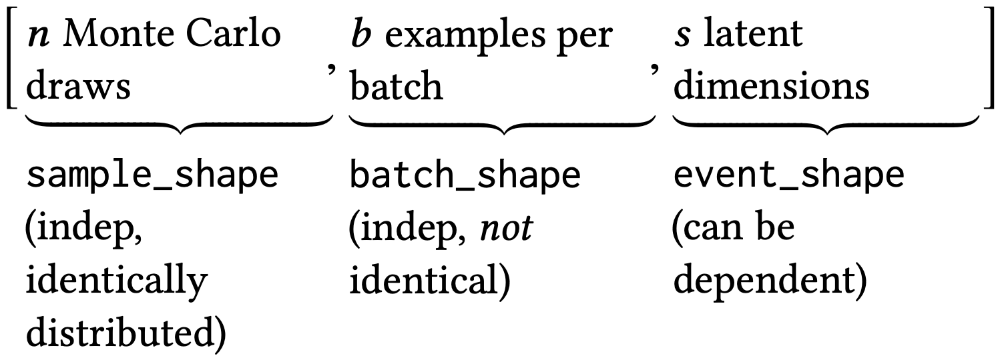

The [`torch.distributions`](https://pytorch.org/docs/1.3.0/distributions.html) package implements various probability distributions, as well as methods for sampling and computing statistics.
It generally follows the design of the [TensorFlow distributions](https://www.tensorflow.org/probability/api_docs/python/tfp/distributions/Distribution) package (Dillon et al. 2017).

There are three types of "shapes", sample shape, batch shape, and event shape, that are crucial to understanding the `torch.distributions` package.
The same definition of shapes is also used in other packages, including [GluonTS](https://gluon-ts.mxnet.io/api/gluonts/gluonts.distribution.html), [Pyro](http://docs.pyro.ai/en/stable/distributions.html), etc.

In this blog post, we describe the different types of shapes and illustrate the differences among them by code examples.
On top of that, we try to answer a few questions related to the shapes in `torch.distributions`. 
All code examples are compatible with PyTorch v1.3.0.


## Three types of shapes

The three types of shapes are defined as follows and illustrated in Figure&nbsp;1.

1. **Sample shape** describes independent, identically distributed draws from the distribution.
1. **Batch shape** describes independent, not identically distributed draws. Namely, we may have a set of (different) parameterizations to the same distribution. This enables the common use case in machine learning of a batch of examples, each modeled by its own distribution.
1. **Event shape** describes the shape of a single draw (event space) from the distribution; it may be dependent across dimensions.

<figure>
    
    <figcaption>Figure 1: Three groups of shapes. Reproduced from Dillon et al. (2017).</figcaption>
</figure>

The definitions above might be difficult to understand. 
We take the Monte Carlo estimation of the evidence lower bound (ELBO) in the variational autoencoder (VAE) as an example to illustrate their differences.
The average ELBO over a batch of $b$ observations, $x\_i$ for $i=1,\ldots,b$, is
$$
\mathcal{L} = 
\frac{1}{b}
\sum\_{i=1}^b
\mathbb{E}\_{q(z|x\_i)}
\log\left[ \frac{p(x\_i | z) p(z)}{q(z | x\_i)} \right],
$$
where $z \in \mathbb{R}^s$ is an $s$-dimensional latent vector.
The ELBO can be estimated by Monte Carlo samples; specifically, for each $x\_i$, $n$ samples are drawn from $z\_{ij} \overset{\text{i.i.d.}}{\sim} q(z|x\_i)$ for $j = 1, \ldots, n$.
The estimate is then
$$
\widehat{\mathcal{L}} = 
\frac{1}{bn}
\sum\_{i=1}^b
\sum\_{j=1}^n
\log\left[ \frac{p(x\_i | z\_{ij}) p(z\_{ij})}{q(z\_{ij} | x\_i)} \right].
$$
All the Monte Carlos samples $z\_{ij}$ can be compactly represented as a tensor of shape $(n, b, s)$ or, correspondingly, `[sample_shape, batch_shape, event_shape]`.


We also provide mathematical notations for a few combinations of shapes in Table&nbsp;1, for Gaussian random variables/vectors.
Ignoring subscripts, $X$ represents a random variable, $\mu$ and $\sigma$ are scalars;
$\mathbf{X}$ denotes a two-dimensional random vector, $\boldsymbol\mu$ is a two-dimensional vector, and $\boldsymbol\Sigma$ is a $2 \times 2$ (not necessarily diagonal) matrix.
Moreover, `[]` and `[2]` denote `torch.Size([])` and `torch.Size([2])`, respectively.
For each row, the link to a PyTorch code example is also given.


<div id="table"></div>

| no. | sample shape | batch shape | event shape | mathematical notation | code |
|---|---|---|---|---|---|
| 1 | `[]` | `[]` | `[]` | $X \sim \mathcal{N}(\mu, \sigma^2)$ | [link](#row-1) |
| 2 | `[2]` | `[]` | `[]` | $X\_1, X\_2 \overset{\text{i.i.d.}}{\sim} \mathcal{N}(\mu, \sigma^2)$ | [link](#row-2) |
| 3 | `[]` | `[2]` | `[]` | $X\_1 \sim \mathcal{N}(\mu\_1, \sigma\_1^2)$<br/>$X\_2 \sim \mathcal{N}(\mu\_2, \sigma\_2^2)$ | [link](#row-3) |
| 4 | `[]` | `[]` | `[2]` | $\mathbf{X} \sim \mathcal{N}(\boldsymbol\mu, \boldsymbol\Sigma)$ | [link](#row-4) |
| 5 | `[]` | `[2]` | `[2]` | $\mathbf{X}\_1 \sim \mathcal{N}(\boldsymbol\mu\_1, \boldsymbol\Sigma\_1)$<br/>$\mathbf{X}\_2 \sim \mathcal{N}(\boldsymbol\mu\_2, \boldsymbol\Sigma\_2)$ | [link](#row-5) |
| 6 | `[2]` | `[]` | `[2]` | $\mathbf{X}\_1, \mathbf{X}\_2 \overset{\text{i.i.d.}}{\sim} \mathcal{N}(\boldsymbol\mu, \boldsymbol\Sigma)$ | [link](#row-6) |
| 7 | `[2]` | `[2]` | `[]` | $X\_{11}, X\_{12} \overset{\text{i.i.d.}}{\sim} \mathcal{N}(\mu\_1, \sigma\_1^2)$<br/>$X\_{21}, X\_{22} \overset{\text{i.i.d.}}{\sim} \mathcal{N}(\mu\_2, \sigma\_2^2)$ | [link](#row-7) |
| 8 | `[2]` | `[2]` | `[2]` | $\mathbf{X}\_{11}, \mathbf{X}\_{12} \overset{\text{i.i.d.}}{\sim} \mathcal{N}(\boldsymbol\mu\_1, \boldsymbol\Sigma\_1)$<br/>$\mathbf{X}\_{21}, \mathbf{X}\_{22} \overset{\text{i.i.d.}}{\sim} \mathcal{N}(\boldsymbol\mu\_2, \boldsymbol\Sigma\_2)$ | [link](#row-8) | 
<figcaption>Table 1: Examples of various combinations of shapes.</figcaption>


This table is adapted from [this blog post](https://ericmjl.github.io/blog/2019/5/29/reasoning-about-shapes-and-probability-distributions/); you might find the visualization in that post helpful.

Every [`Distribution`](https://pytorch.org/docs/1.3.0/distributions.html#torch.distributions.distribution.Distribution) class has instance attributes `batch_shape` and `event_shape`. 
Furthermore, each class also has a method `.sample`, which takes `sample_shape` as an argument and generates samples from the distribution.
Note that `sample_shape` is not an instance attribute because, conceptually, it is not associated with a distribution.


## What is the difference between `Normal` and `MultivariateNormal`?

There are two distribution classes that correspond to normal distributions: the univariate normal
```
torch.distributions.normal.Normal(loc, scale, validate_args=None)
```
and the multivariate normal
```
torch.distributions.multivariate_normal.MultivariateNormal(loc, 
covariance_matrix=None, precision_matrix=None, scale_tril=None, 
validate_args=None)
```

Since the [`Normal`](https://pytorch.org/docs/1.3.0/distributions.html#normal) class represents univariate normal distributions, the `event_shape` of a `Normal` instance is always `torch.Size([])`.
Even if the `loc` or `scale` arguments are high-order tensors, their "shapes" will go to `batch_shape`.
For example, 

<!-- ```
normal = Normal(torch.randn(5, 3, 2), torch.ones(5, 3, 2))
(normal.batch_shape, normal.event_shape)
```
 -->

```
>>> normal = Normal(torch.randn(5, 3, 2), torch.ones(5, 3, 2))
>>> (normal.batch_shape, normal.event_shape)
(torch.Size([5, 3, 2]), torch.Size([]))
```

<!-- ```
mvn = MultivariateNormal(torch.randn(5, 3, 2), torch.eye(2))
(mvn.batch_shape, mvn.event_shape)
``` -->

In contrast, for [`MultivariateNormal`](https://pytorch.org/docs/1.3.0/distributions.html#multivariatenormal), the `batch_shape` and `event_shape` can be inferred from the shape of `covariance_matrix`.
In the following example, the covariance matrix `torch.eye(2)` is $2 \times 2$ matrix, so it can be inferred that the `event_shape` should be `[2]` and the `batch_shape` is `[5, 3]`.

```
>>> mvn = MultivariateNormal(torch.randn(5, 3, 2), torch.eye(2))
>>> (mvn.batch_shape, mvn.event_shape)
(torch.Size([5, 3]), torch.Size([2]))
```

## What does `.expand` do?

Every [`Distribution`](https://pytorch.org/docs/1.3.0/distributions.html#torch.distributions.distribution.Distribution) instance has an [`.expand`](https://pytorch.org/docs/1.3.0/distributions.html#torch.distributions.distribution.Distribution.expand) method. Its docstring is as follows:

```python
class Distribution(object):

    def expand(self, batch_shape, _instance=None):
        """
        Returns a new distribution instance (or populates an existing instance
        provided by a derived class) with batch dimensions expanded to
        `batch_shape`. This method calls :class:`~torch.Tensor.expand` on
        the distribution's parameters. As such, this does not allocate new
        memory for the expanded distribution instance. Additionally,
        this does not repeat any args checking or parameter broadcasting in
        `__init__.py`, when an instance is first created.

        Args:
            batch_shape (torch.Size): the desired expanded size.
            _instance: new instance provided by subclasses that
                need to override `.expand`.

        Returns:
            New distribution instance with batch dimensions expanded to
            `batch_size`.
        """
        raise NotImplementedError
```

<!-- ```
mvn = MultivariateNormal(torch.randn(2), torch.eye(2))
(mvn.batch_shape, mvn.event_shape)
new_batch_shape = torch.Size([5])
expanded_mvn = mvn.expand(new_batch_shape)
(expanded_mvn.batch_shape, expanded_mvn.event_shape)
expanded_mvn.loc
batched_mvn = MultivariateNormal(torch.randn(5, 2), torch.eye(2))
(batched_mvn.batch_shape, batched_mvn.event_shape)
batched_mvn.loc
``` -->

It essentially creates a new distribution instance by expanding the `batch_shape`.
For example, if we define a `MultivariateNormal` instance with a `batch_shape` of `[]` and an `event_shape` of `[2]`,
```
>>> mvn = MultivariateNormal(torch.randn(2), torch.eye(2))
>>> (mvn.batch_shape, mvn.event_shape)
(torch.Size([]), torch.Size([2]))
```
it can be expanded to a new instance that have a `batch_shape` of `[5]`:

```
>>> new_batch_shape = torch.Size([5])
>>> expanded_mvn = mvn.expand(new_batch_shape)
>>> (expanded_mvn.batch_shape, expanded_mvn.event_shape)
(torch.Size([5]), torch.Size([2]))
```

Note that no new memory is allocated in this process; therefore, all batch dimensions have the same location parameter.

```
>>> expanded_mvn.loc
tensor([[-2.2299,  0.0122],
        [-2.2299,  0.0122],
        [-2.2299,  0.0122],
        [-2.2299,  0.0122],
        [-2.2299,  0.0122]])
```

This can be compared with the following example with the same `batch_shape` of `[5]` and `event_shape` of `[2]`.
However, the batch dimensions have different location parameters.

```
>>> batched_mvn = MultivariateNormal(torch.randn(5, 2), torch.eye(2))
>>> (batched_mvn.batch_shape, batched_mvn.event_shape)
(torch.Size([5]), torch.Size([2]))
>>> batched_mvn.loc
tensor([[-0.3935, -0.7844],
        [ 0.3310,  0.9311],
        [-0.8141, -0.2252],
        [ 2.4199, -0.5444],
        [ 0.5586,  1.0157]])
```


## What is the `Independent` class?

The [`Independent`](https://pytorch.org/docs/1.3.0/distributions.html#independent) class does not represent any probability distribution. 
Instead, it creates a new distribution instance by "reinterpreting" some of the batch shapes of an existing distribution as event shapes.
```
torch.distributions.independent.Independent(base_distribution, 
reinterpreted_batch_ndims, validate_args=None)
```
The first argument `base_distribution` is self-explanatory; the second argument `reinterpreted_batch_ndims` is the number of batch shapes to be reinterpreted as event shapes.

The usage of the `Independent` class can be illustrated by the following example.
We start with a `Normal` instance with a `batch_shape` of `[5, 3, 2]` and an `event_shape` of `[]`.

<!-- ```
loc = torch.zeros(5, 3, 2)
scale = torch.ones(2)
normal = Normal(loc, scale)
[normal.batch_shape, normal.event_shape]
``` -->

```
>>> loc = torch.zeros(5, 3, 2)
>>> scale = torch.ones(2)
>>> normal = Normal(loc, scale)
>>> [normal.batch_shape, normal.event_shape]
[torch.Size([5, 3, 2]), torch.Size([])]
```

An `Independent` instance can reinterpret the last `batch_shape` as the `event_shape`.
As a result, the new `batch_shape` is `[5, 3]`, and the `event_shape` now becomes `[2]`.

<!-- ```
normal_ind_1 = Independent(normal, 1)
[normal_ind_1.batch_shape, normal_ind_1.event_shape]
``` -->

```
>>> normal_ind_1 = Independent(normal, 1)
>>> [normal_ind_1.batch_shape, normal_ind_1.event_shape]
[torch.Size([5, 3]), torch.Size([2])]
```
The instance `normal_ind_1` is essentially the same as the following `MultivariateNormal` instance:

<!-- ```
mvn = MultivariateNormal(loc, torch.diag(scale))
[mvn.batch_shape, mvn.event_shape]
``` -->

```
>>> mvn = MultivariateNormal(loc, torch.diag(scale))
>>> [mvn.batch_shape, mvn.event_shape]
[torch.Size([5, 3]), torch.Size([2])]
```

We can further reinterpret more batch shapes as event shapes:

<!-- ```
normal_ind_1_ind_1 = Independent(normal_ind_1, 1)
[normal_ind_1_ind_1.batch_shape, normal_ind_1_ind_1.event_shape]
``` -->

```
>>> normal_ind_1_ind_1 = Independent(normal_ind_1, 1)
>>> [normal_ind_1_ind_1.batch_shape, normal_ind_1_ind_1.event_shape]
[torch.Size([5]), torch.Size([3, 2])
```

or equivalently,

<!-- ```
normal_ind_2 = Independent(normal, 2)
[normal_ind_2.batch_shape, normal_ind_2.event_shape]
``` -->

```
>>> normal_ind_2 = Independent(normal, 2)
>>> [normal_ind_2.batch_shape, normal_ind_2.event_shape]
[torch.Size([5]), torch.Size([3, 2])]
```


## PyTorch code examples

In this section, code examples for each row in the [Table&nbsp;1](#table) are provided.
The following `import` statements are needed for the examples.
```python
import torch
from torch.distributions.normal import Normal
from torch.distributions.multivariate_normal import MultivariateNormal
```

### Row 1: `[], [], []` {#row-1}

<!-- ```
dist = Normal(0.0, 1.0)
sample_shape = torch.Size([])
dist.sample(sample_shape)
(sample_shape, dist.batch_shape, dist.event_shape)
``` -->

```
>>> dist = Normal(0.0, 1.0)
>>> sample_shape = torch.Size([])
>>> dist.sample(sample_shape)
tensor(-1.3349)
>>> (sample_shape, dist.batch_shape, dist.event_shape)
(torch.Size([]), torch.Size([]), torch.Size([]))
```
[back to Table&nbsp;1](#table)

### Row 2: `[2], [], []` {#row-2}

<!-- ```
dist = Normal(0.0, 1.0)
sample_shape = torch.Size([2])
dist.sample(sample_shape)
(sample_shape, dist.batch_shape, dist.event_shape)
``` -->

```
>>> dist = Normal(0.0, 1.0)
>>> sample_shape = torch.Size([2])
>>> dist.sample(sample_shape)
tensor([ 0.2786, -1.4113])
>>> (sample_shape, dist.batch_shape, dist.event_shape)
(torch.Size([2]), torch.Size([]), torch.Size([]))
```
[back to Table&nbsp;1](#table)

### Row 3: `[], [2], []` {#row-3}

<!-- ```
dist = Normal(torch.zeros(2), torch.ones(2))
sample_shape = torch.Size([])
dist.sample(sample_shape)
(sample_shape, dist.batch_shape, dist.event_shape)
``` -->

```
>>> dist = Normal(torch.zeros(2), torch.ones(2))
>>> sample_shape = torch.Size([])
>>> dist.sample(sample_shape)
tensor([0.0101, 0.6976])
>>> (sample_shape, dist.batch_shape, dist.event_shape)
(torch.Size([]), torch.Size([2]), torch.Size([]))
```
[back to Table&nbsp;1](#table)

### Row 4: `[], [], [2]` {#row-4}

<!-- ```
dist = MultivariateNormal(torch.zeros(2), torch.eye(2))
sample_shape = torch.Size([])
dist.sample(sample_shape)
(sample_shape, dist.batch_shape, dist.event_shape)
``` -->

```
>>> dist = MultivariateNormal(torch.zeros(2), torch.eye(2))
>>> sample_shape = torch.Size([])
>>> dist.sample(sample_shape)
tensor([ 0.2880, -1.6795])
>>> (sample_shape, dist.batch_shape, dist.event_shape)
(torch.Size([]), torch.Size([]), torch.Size([2]))
```
[back to Table&nbsp;1](#table)

### Row 5: `[], [2], [2]` {#row-5}

<!-- ```
dist = MultivariateNormal(torch.zeros(2, 2), torch.eye(2))
sample_shape = torch.Size([])
dist.sample(sample_shape)
(sample_shape, dist.batch_shape, dist.event_shape)
``` -->

```
>>> dist = MultivariateNormal(torch.zeros(2, 2), torch.eye(2))
>>> sample_shape = torch.Size([])
>>> dist.sample(sample_shape)
tensor([[-0.4703,  0.4152],
        [-1.6471, -0.6276]])
>>> (sample_shape, dist.batch_shape, dist.event_shape)
(torch.Size([]), torch.Size([2]), torch.Size([2]))
```
[back to Table&nbsp;1](#table)

### Row 6: `[2], [], [2]` {#row-6}

<!-- ```
dist = MultivariateNormal(torch.zeros(2), torch.eye(2))
sample_shape = torch.Size([2])
dist.sample(sample_shape)
(sample_shape, dist.batch_shape, dist.event_shape)
``` -->

```
>>> dist = MultivariateNormal(torch.zeros(2), torch.eye(2))
>>> sample_shape = torch.Size([2])
>>> dist.sample(sample_shape)
tensor([[ 2.2040, -0.7195],
        [-0.4787,  0.0895]])
>>> (sample_shape, dist.batch_shape, dist.event_shape)
(torch.Size([2]), torch.Size([]), torch.Size([2]))
```
[back to Table&nbsp;1](#table)

### Row 7: `[2], [2], []` {#row-7}

<!-- ```
dist = Normal(torch.zeros(2), torch.ones(2))
sample_shape = torch.Size([2])
dist.sample(sample_shape)
(sample_shape, dist.batch_shape, dist.event_shape)
``` -->

```
>>> dist = Normal(torch.zeros(2), torch.ones(2))
>>> sample_shape = torch.Size([2])
>>> dist.sample(sample_shape)
tensor([[ 0.2639,  0.9083],
        [-0.7536,  0.5296]])
>>> (sample_shape, dist.batch_shape, dist.event_shape)
(torch.Size([2]), torch.Size([2]), torch.Size([]))
```
[back to Table&nbsp;1](#table)

### Row 8: `[2], [2], [2]` {#row-8}

<!-- ```
dist = MultivariateNormal(torch.zeros(2, 2), torch.eye(2))
sample_shape = torch.Size([2])
dist.sample(sample_shape)
(sample_shape, dist.batch_shape, dist.event_shape)
``` -->

```
>>> dist = MultivariateNormal(torch.zeros(2, 2), torch.eye(2))
>>> sample_shape = torch.Size([2])
>>> dist.sample(sample_shape)
tensor([[[ 0.4683,  0.6118],
         [ 1.0697, -0.0856]],

        [[-1.3001, -0.1734],
         [ 0.4705, -0.0404]]])
>>> (sample_shape, dist.batch_shape, dist.event_shape)
(torch.Size([2]), torch.Size([2]), torch.Size([2]))
```
[back to Table&nbsp;1](#table)

## References

* Dillon, J. V., Langmore, I., Tran, D., Brevdo, E., Vasudevan, S., Moore, D., ... & Saurous, R. A. (2017). Tensorflow distributions. arXiv preprint arXiv:1711.10604.


